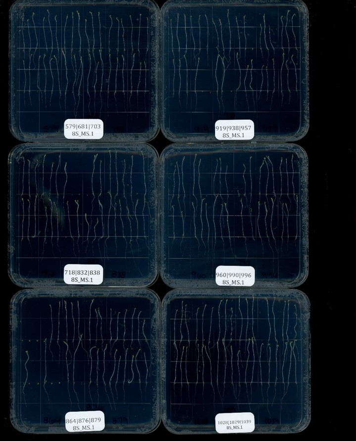
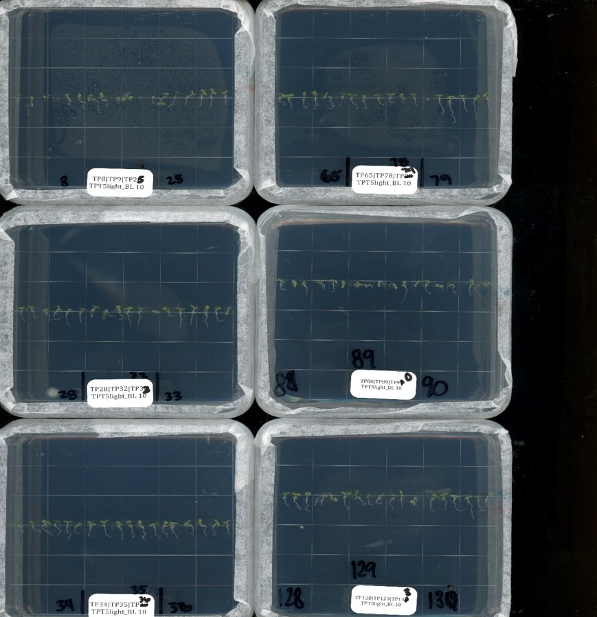
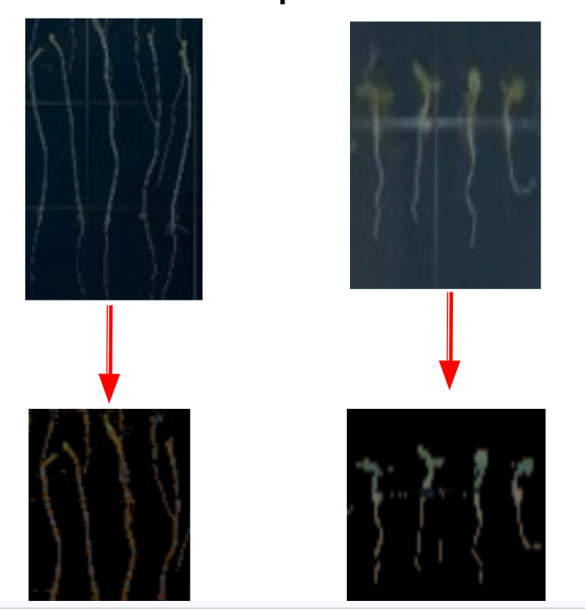
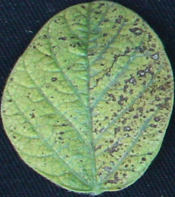
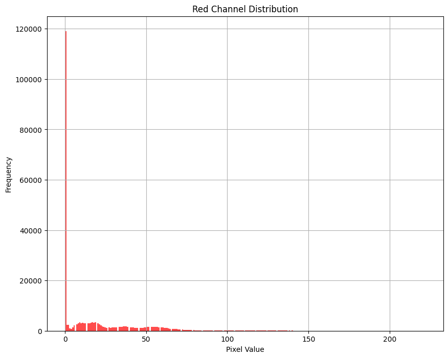
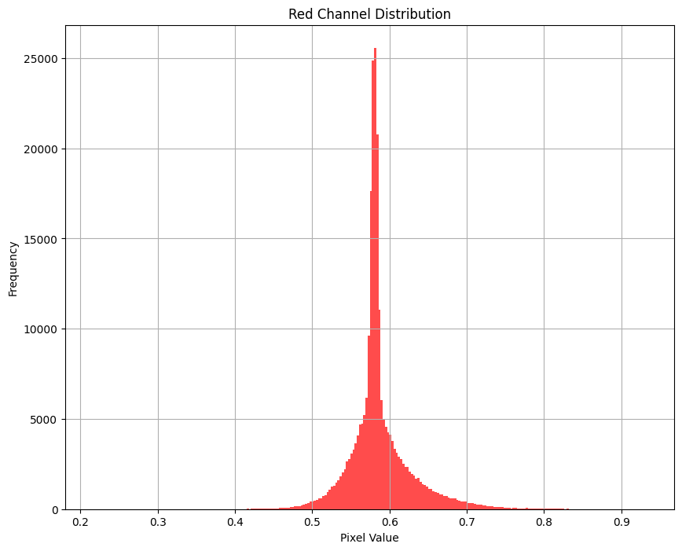

<!-- THIS NOTEBOOK  CONTAINS THE  INFORMATION OF WHAT IS DONE-->
# LEAF SEGMENTATION
We take complicated image of the adreapolis seedings and segment out the seedlings
[Notebook Link](./notebook_segementation/leafsegmentation.ipynb)

**Image 1**

 

**Image 2** 

 

 

**Results**
 

 

 
 

<!-- THIS NOTEBOOK  CONTAINS THE  INFORMATION OF WHAT IS DONE-->
# Leaf Preprocessing and Transformation
The goal is to perform some preprocess-ing of images obtained for leaves that may or may not be diseased
[Notebook Link](./notebook_preprocessing/image_preprocessing_transformation.ipynb)

**Sample Image**

 

 

**Results**

Original Histogram vs Prewhitened Histogram
 

  

## Acknowledgments

* We acknowledge the class ME 592 by Dr Soumik Sarkar

## Authors

* Samundra Karki
* Pallavi Kandanur
* Connor J Castonguay
* Charchit Shukla
